## Build your own voice assistant and run it locally: Whisper + Ollama + ChatterBox

> Original article: https://blog.duy-huynh.com/build-your-own-voice-assistant-and-run-it-locally/
>
> **Updated May 2025**: Now using [Chatterbox TTS](https://github.com/resemble-ai/chatterbox), a state-of-the-art open-source TTS model from Resemble AI!
>
> The original implementation using Bark has been preserved in the `archive-2025-05-29` branch for reference.

After my latest post about how to build your own RAG and run it locally. Today, we're taking it a step further by not only implementing the conversational abilities of large language models but also adding listening and speaking capabilities. The idea is straightforward: we are going to create a voice assistant reminiscent of Jarvis or Friday from the iconic Iron Man movies, which can operate offline on your computer.

**New Features with ChatterBox:**
- 🎯 **Voice Cloning**: Clone any voice with just a short audio sample
- 🎭 **Emotion Control**: Adjust emotional expressiveness of responses
- 🚀 **Better Performance**: 0.5B parameter model with faster inference
- 💧 **Watermarked Audio**: Built-in neural watermarking for authenticity

### Techstack
First, you should set up a virtual Python environment. You have several options for this, including pyenv, virtualenv, poetry, and others that serve a similar purpose. Personally, I'll use Poetry for this tutorial due to my personal preferences. Here are several crucial libraries you'll need to install:

- **rich**: For a visually appealing console output.
- **openai-whisper**: A robust tool for speech-to-text conversion.
- **chatterbox-tts**: State-of-the-art text-to-speech synthesis with voice cloning and emotion control.
- **langchain**: A straightforward library for interfacing with Large Language Models (LLMs).
- **sounddevice**, **pyaudio**, and **speechrecognition**: Essential for audio recording and playback.

For a detailed list of dependencies, refer to the link here.

The most critical component here is the Large Language Model (LLM) backend, for which we will use Ollama. Ollama is widely recognized as a popular tool for running and serving LLMs offline. If Ollama is new to you, I recommend checking out my previous article on offline RAG: "Build Your Own RAG and Run It Locally: Langchain + Ollama + Streamlit". Basically, you just need to download the Ollama application, pull your preferred model, and run it.

### Architecture
Okay, if everything has been set up, let's proceed to the next step. Below is the overall architecture of our application, which fundamentally comprises 3 main components:

- **Speech Recognition**: Utilizing OpenAI's Whisper, we convert spoken language into text. Whisper's training on diverse datasets ensures its proficiency across various languages and dialects.
- **Conversational Chain**: For the conversational capabilities, we'll employ the Langchain interface for the Llama-2 model (or any other model), which is served using Ollama. This setup promises a seamless and engaging conversational flow.
- **Speech Synthesizer**: The transformation of text to speech is achieved through Chatterbox TTS, a state-of-the-art model from Resemble AI, renowned for its lifelike speech production and voice cloning capabilities.

The workflow is straightforward: record speech, transcribe to text, generate a response using an LLM, and vocalize the response using ChatterBox.

```mermaid
flowchart TD
    A[🎤 User Speech Input] --> B[Speech Recognition<br/>OpenAI Whisper]
    B --> C[📝 Text Transcription]
    C --> D[Conversational Chain<br/>Langchain + Ollama<br/>Gemma3 / Llama-4 / Other LLMs]
    D --> E[🤖 Generated Response]
    E --> F[Speech Synthesizer<br/>Chatterbox TTS]
    F --> G[🔊 Audio Output]
    G --> H[👤 User Hears Response]

    style A fill:#e1f5fe
    style B fill:#f3e5f5
    style C fill:#e8f5e8
    style D fill:#fff3e0
    style E fill:#e8f5e8
    style F fill:#f3e5f5
    style G fill:#e1f5fe
    style H fill:#fce4ec
```



### Installation

```bash
# Clone the repository
git clone https://github.com/vndee/local-talking-llm.git
cd local-talking-llm

# Install dependencies
pip install -r requirements.txt

# Download NLTK data (for sentence tokenization)
python -c "import nltk; nltk.download('punkt')"

# Install and start Ollama
# Follow instructions at https://ollama.ai
ollama pull llama2  # or any other model you prefer
```

### Usage

#### Basic Usage
```bash
python app.py
```

#### With Voice Cloning
Record a 10-30 second audio sample of the voice you want to clone, then:
```bash
python app.py --voice path/to/voice_sample.wav
```

#### With Custom Settings
```bash
# Adjust emotion and pacing
python app.py --exaggeration 0.7 --cfg-weight 0.3

# Use a different LLM model
python app.py --model codellama

# Save generated voice samples
python app.py --save-voice
```

### Configuration Options

- `--voice`: Path to audio file for voice cloning
- `--exaggeration`: Emotion intensity (0.0-1.0, default: 0.5)
  - Lower values (0.3-0.4): Calmer, more neutral delivery
  - Higher values (0.7-0.9): More expressive and emotional
- `--cfg-weight`: Controls pacing and delivery style (0.0-1.0, default: 0.5)
  - Lower values: Faster, more dynamic speech
  - Higher values: Slower, more deliberate speech
- `--model`: Ollama model to use (default: llama2)
- `--save-voice`: Save generated audio responses to `voices/` directory

### Implementation Details

#### TextToSpeechService with ChatterBox
The new TextToSpeechService leverages ChatterBox's advanced features:

```python
from chatterbox.tts import ChatterboxTTS

class TextToSpeechService:
    def __init__(self, device: str = "cuda" if torch.cuda.is_available() else "cpu"):
        self.device = device
        self.model = ChatterboxTTS.from_pretrained(device=device)
        self.sample_rate = self.model.sr

    def synthesize(self, text: str, audio_prompt_path: str = None,
                  exaggeration: float = 0.5, cfg_weight: float = 0.5):
        wav = self.model.generate(
            text,
            audio_prompt_path=audio_prompt_path,
            exaggeration=exaggeration,
            cfg_weight=cfg_weight
        )
        return self.sample_rate, wav.squeeze().cpu().numpy()
```

Key improvements over the previous Bark implementation:
- **Voice Cloning**: Pass an audio file to clone any voice
- **Emotion Control**: Adjust expressiveness with the `exaggeration` parameter
- **Better Quality**: ChatterBox produces more natural-sounding speech
- **Faster Inference**: Smaller model size (0.5B vs Bark's larger models)

#### Dynamic Emotion Analysis
The app now includes automatic emotion detection to make responses more expressive:

```python
def analyze_emotion(text: str) -> float:
    emotional_keywords = ['amazing', 'terrible', 'love', 'hate', 'excited',
                         'sad', 'happy', 'angry', '!', '?!']
    emotion_score = 0.5
    for keyword in emotional_keywords:
        if keyword in text.lower():
            emotion_score += 0.1
    return min(0.9, max(0.3, emotion_score))
```

### Tips for Best Results

1. **Voice Cloning**:
   - Use a clear 10-30 second audio sample
   - Ensure the sample has minimal background noise
   - The voice should speak naturally in the sample

2. **Emotion Control**:
   - For general conversation: `exaggeration=0.5, cfg_weight=0.5`
   - For dramatic/expressive speech: `exaggeration=0.7+, cfg_weight=0.3`
   - For calm/professional tone: `exaggeration=0.3, cfg_weight=0.7`

3. **Performance**:
   - Use CUDA if available for faster inference
   - The first generation might be slower due to model loading
   - Consider using smaller Whisper models ("tiny.en" or "base.en") for faster transcription

### Scaling to Production

For those aiming to elevate this application to a production-ready status, consider:

- **Performance Optimization**:
  - Use optimized inference engines (ONNX, TensorRT)
  - Implement model quantization for faster inference
  - Add caching for frequently used phrases

- **Enhanced Features**:
  - Multi-speaker support with voice profiles
  - Real-time voice conversion
  - Integration with more LLM providers
  - Web interface with real-time streaming

- **Voice Database**:
  - Create a library of voice samples
  - Implement voice selection UI
  - Add voice mixing capabilities

- **API Service**:
  - RESTful API for TTS requests
  - WebSocket support for real-time communication
  - Rate limiting and authentication

### Troubleshooting

- **CUDA out of memory**: Use CPU mode or reduce model precision
- **Microphone not working**: Check system permissions and device settings
- **Slow inference**: Ensure you're using GPU if available, consider using smaller models
- **Voice cloning quality**: Use higher quality audio samples with clear speech

### Conclusion

With the integration of ChatterBox, we've significantly enhanced our local voice assistant. The addition of voice cloning and emotion control opens up new possibilities for creating personalized and expressive AI assistants. Whether you're building a personal Jarvis, creating content, or developing voice-enabled applications, this updated stack provides a powerful foundation.

The combination of Whisper's robust speech recognition, Ollama's flexible LLM serving, and ChatterBox's advanced TTS capabilities creates a fully-featured voice assistant that runs entirely offline. No cloud services, no API keys, just pure local AI power!

### Resources

- [ChatterBox GitHub](https://github.com/resemble-ai/chatterbox)
- [Ollama](https://ollama.ai)
- [Whisper](https://github.com/openai/whisper)
- [Original Blog Post](https://blog.duy-huynh.com/build-your-own-voice-assistant-and-run-it-locally/)

---

